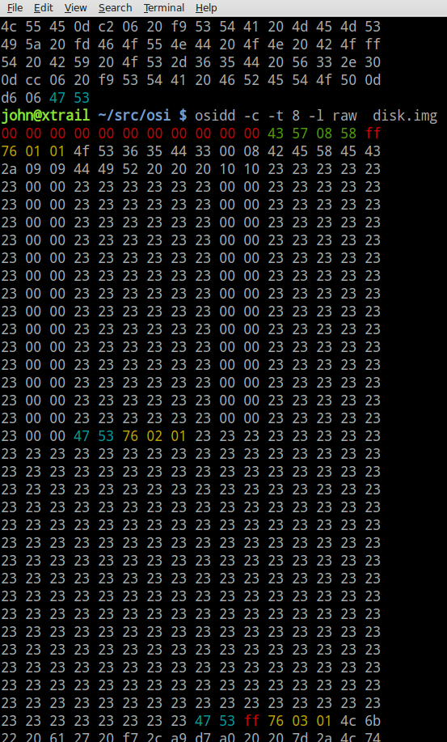

Collection of Notes on OS65D Disk Format
========================================

From C3Serial Disk Dump Program
-------------------------------
    ;Track 0 format
    ;1 millisecond delay after index hole
    ;0,1 load address of the track in hi,lo form
    ;2, page count of how much data is written on track 0, usually 8
    ;3+ data

    ;Track 1-n Format
    ;0,1 -a 2 byte start code $43, $57
    ;2,  -BCD track number
    ;3,  -track type code (always $58)

    ; sector data
    ;1,  -sector start code $76
    ;1,  -sector number in binary
    ;1   -sector length (#pages) in binary
    ;x   -sector data (1-8/12 pages)
    ;2   -end of sector mark $47, $53
    ; next sector

    ;track 1-76 format
    ; 8E1 
    ; 0x80, tklo, tkhi, <reset ACIA to 8N1> 0x1F ... data ...

From OS65D Tutorial Document (Page 57)
--------------------------------------

+ Tracks start 1 msec after the index hole
+ Track zero has a unique header read by choosing "D"
+ Track zero header has three bytes
    + load address hi byte           normally=0x22
    + load address lo byte           normally=0x00
    + number of pages on track zero  normally=0x08
+ The rest of the tracks have a four byte header
    + byte one $43
    + byte two $57 
    + track number as two digit BCD number
    + byte four $58

From Review of Disk Images
--------------------------
For this particular disk image Track 1 started at byte offset $0f00.

    ------------------------------------------- Track Header
    0f00 43     first byte of track header
    0f01 57     second byte of track header
    0f02 01     track number in BCD format
    0f03 05     number of pages
    ------------------------------------------- Sector 1
    0f04 76     start of sector header
    0f05 01     sector number in binary
    0f06 05     number of pages
    0f07 xx     first byte of data 
    0f08 xx
    .    xx       0f08 +(256*pages)-1 = 1406
    .    xx       0f08 + 04ff        = 1406
    .    xx
    1406 xx     last byte of data
    1407 47     end of sector marker 1st byte 
    1408 52     end of sector marker 2nd byte
    ------------------------------------------- Sector 2
    1409 76     start of sector header
    140a 01     sector number in binary
    140b 05     number of pages
    140c xx     first byte of data 
    .    xx       0f08 +(256*pages)-1 = 1406
    .    xx       0f08 + 04ff        = 1406
    .    xx
    190b xx     last byte of data
    190c 47     end of sector marker 1st byte 
    190d 52     end of sector marker 2nd byte
    -------------------------------------------
    190a 00
    .    00
    .    00     undefine data at end of the track 
    .    00
    ------------------------------------------- Next Track 
    xx00 43     first byte of track header
    xx01 57     second byte of track header
    xx02 01     track number in BCD format
    xx03 05     number of pages

Here is an example of the raw disk data showing the first three
sectors of track 8:

 

Directory Listings
------------------

Track 8 sectors 1 and 2 hold the directory listing.
The format is very simple

    + six bytes for name followed by
    + two bytes for start and end track
    + sector 1 has 32 entries
    + secrot 2 as 32 entries
    + blank entries have a # (0x23) at start of name

Code extract from the DIR command

     10030 PRINT #DV : PRINT #DV,"OS-65D VERSION 3.2  NMHZ"
     10035 PRINT #DV," -- DIRECTORY --" : PRINT #DV
     10040 PRINT #DV,"FILE NAME    TRACK RANGE"
     10050 PRINT #DV,"------------------------"

    +load first sector into memory
     10060 DISK ! "CALL 2E79=08,1"
     10070 GOSUB 11000
    +load second sector into memory
     10080 DISK ! "CALL 2E79=08,2"
     10090 GOSUB 11000
    +print number of free (empty) directory entries
     10130 PRINT #DV : PRINT #DV,NF;"ENTRIES FREE OUT OF 64" : PRINT #DV
     10140 END

     11010 REM READ DIRECTORY OUT OF BUFFER INTO ARRAYS
    + PN points to memory location 11897 (0x2e79)
     11040 FOR I=PN TO PN+248 STEP 8

    +if char is # then this is a free entry
     11050 IF PEEK(I)=35 THEN NF=NF+1 : GOTO 11130

    +read name from first six bytes
     11060 N$=""
     11070 FOR J=I TO I+5
     11080 N$=N$+CHR$(PEEK(J))
     11090 NEXT J
    +print name and start track (7th byte) and end track (8th byte)
     11100 PRINT #DV,N$;TAB(12);FNA(PEEK(I+6));TAB(16);"-";
     11110 PRINT #DV,TAB(17);FNA(PEEK(I+7))
     11130 NEXT I
     11140 RETURN

Here is a sample directory listing with three files:

    OS-65D VERSION 3.2
     -- DIRECTORY --

    FILE NAME    TRACK RANGE
    ------------------------
    OS65D3		0 - 8
    BEXEC*		9 - 9
    DIR   		10 - 10

And, here is the data on track 8 for that listing:

    Track8:  Sector1: Pages: 0x01 (1)  Unknown
    003179  4f 53 36 35 44 33 00 08 42 45 58 45 43 2a 09 09   |OS65D3..BEXEC*..|
    003189  44 49 52 20 20 20 10 10 23 23 23 23 23 23 00 00   |DIR   ..######..|
    003199  23 23 23 23 23 23 00 00 23 23 23 23 23 23 00 00   |######..######..|
    0031a9  23 23 23 23 23 23 00 00 23 23 23 23 23 23 00 00   |######..######..|
    0031b9  23 23 23 23 23 23 00 00 23 23 23 23 23 23 00 00   |######..######..|
    0031c9  23 23 23 23 23 23 00 00 23 23 23 23 23 23 00 00   |######..######..|
    0031d9  23 23 23 23 23 23 00 00 23 23 23 23 23 23 00 00   |######..######..|
    0031e9  23 23 23 23 23 23 00 00 23 23 23 23 23 23 00 00   |######..######..|
    0031f9  23 23 23 23 23 23 00 00 23 23 23 23 23 23 00 00   |######..######..|
    003209  23 23 23 23 23 23 00 00 23 23 23 23 23 23 00 00   |######..######..|
    003219  23 23 23 23 23 23 00 00 23 23 23 23 23 23 00 00   |######..######..|
    003229  23 23 23 23 23 23 00 00 23 23 23 23 23 23 00 00   |######..######..|
    003239  23 23 23 23 23 23 00 00 23 23 23 23 23 23 00 00   |######..######..|
    003249  23 23 23 23 23 23 00 00 23 23 23 23 23 23 00 00   |######..######..|
    003259  23 23 23 23 23 23 00 00 23 23 23 23 23 23 00 00   |######..######..|
    003269  23 23 23 23 23 23 00 00 23 23 23 23 23 23 00 00   |######..######..|

Basic Format
------------
Basic files are loaded starting at memory $3179.  The file includes
a start address, end address and number of tracks.
In the example below: start=$317f end=$342a tracks=01 followed by NULL.

    003179  7f 31 2a 34 01 00 8d 31 05 00 44 56 ab 31 3a 20   |.1*4...1..DV.1: |
    003189  88 32 30 00 a6 31 0a 00 84 20 22 44 45 56 49 43   |.20..1... .DEVIC|

The first line of the source is a at $317f.  Each line is has a pointer
to the next line, line number , line text or tokens.  All the basic key
words are saved a tokens value ($80-$c3). In the example below we see the
first line points to the second line at $318d.  It is line number $0005 and
finishes with a NULL. The second line is line 10 and starts with a token $84
which is the INPUT keyword.

     8d 31 05 00 44 56 ab 31 3a 20 88 32 30 00
     ----- -----                            --
     |     line 5                          eol
     |
     --->a6 31 0a 00 84 20 22 44 45 56 49 43 45 20 ...3b 44 56 00
          ----- ----                                           --
                line 10                                        eol

Assembler Source Files
----------------------
Assembler files are loaded starting at memory $3179.  The file includes
a start address, end address and  number of tracks.
In the example below: start=$317e end=$3976 tracks=01.

    000000  7e 31 76 39 01 0a 00 3b 0d 14 00 41 43 49 41 31   |~1v9...;...ACIA1|
    000010  20 fd 3d 24 43 46 30 ff 20 ff 43 33 41 20 f7 31   | .=$CF0. .C3A .1|
    000020  32 30 ff 20 42 41 55 44 0d 1e 00 41 43 49 41 32   |20. BAUD...ACIA2|
    000030  20 fd 3d 24 43 46 30 32 20 ff 43 32 4f 45 4d 20   | .=$CF02 .C2OEM |

Each source line is a line number followed by text upto a carraige return <0x0d>.
Repeated characters are represented by negitive numbers (-1 <0xff> for repeat
one, -2 <0xfe> for repeat two, etc).  Weird stuff.

    line 10
          ;  <cr>
    0a 00 3b 0d

    line 20
           ACIA1<sp><repeat 3>=$CFO<repeat 1><sp><repeat 1>C3A<sp><repeat 9>
    14 00 41 43 49 41 31 20 fd 3d 24 43 46 30 ff 20 ff 43 33 41 20 f7
    
       120<repeat 1><sp>BAUD<cr>
       31 32 30 ff 20 42 41 55 44 0d

----------------------------------------------------
2015/12/05

[Guestbook and Comments](../gbook.html)

[Back](../index.html)
